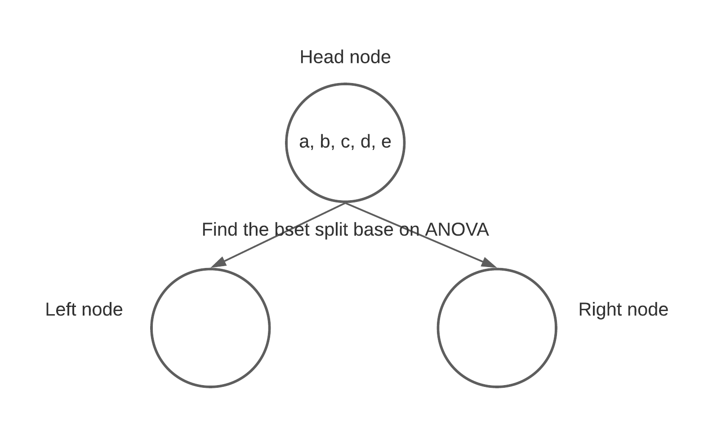
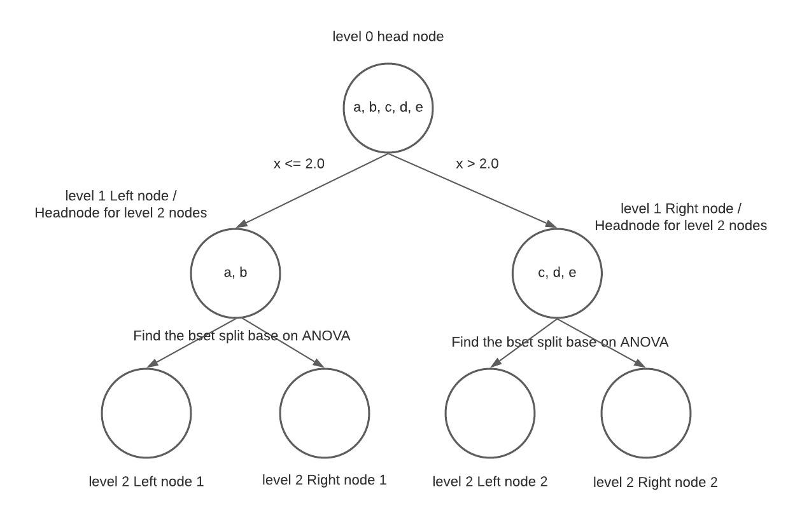
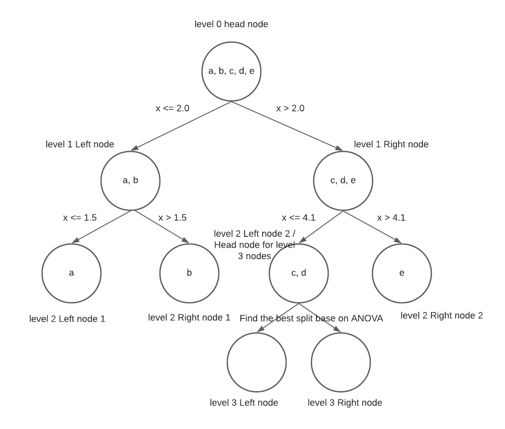
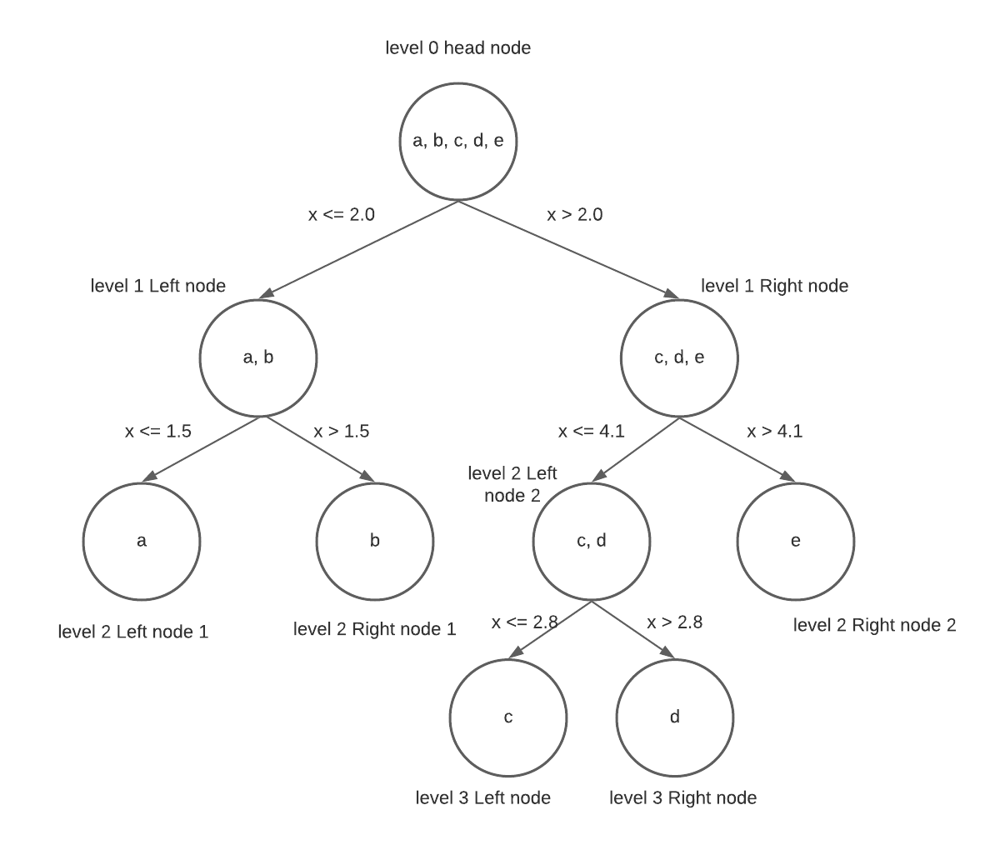

```{r setup, include=FALSE}
knitr::opts_chunk$set(echo = TRUE,
                      message = FALSE,
                      fig.height = 4,
                      fig.width = 6)
```

In regression, we can use the ANOVA information criterion to find the best split that separate our data points in the head node into two nodes, that is left node and right node.



```{r}
library(tidyverse)
d <- tibble(x = c(1.5, 2.8, 4.1, 2.0, 5.2), 
            y = c(6.2, 4.8, 5.1, 7.1, 3.7)) %>%
  mutate(label = c("a", "c", "d", "b", "e"))
d
```

In this exercise, we add the `label` variable to the data set base on the descending order of x in order to indicate the data point in the plot, it won't affect the result.

```{r}
ggplot(data = d, aes(x = x, y = y, label = label)) +
  geom_point() +
  geom_label()
```

The regression tree will go through the point `a` to point `e` base on `x` variable to find the best split in this simple regression tree. 

The ANOVA criterion is:

$$
ANOVA = SST - (SSG_1 + SSG_2)
\\SST = \sum_{i=1}^{n}(y_i - \overline{y}) \text{, where } \overline{y} = \frac{1}{n} \sum_{i=1}^{n}y_i \text{, and } y_1,y_2,...,y_n \text{ is the data points in the head node.}
\\SSG_1 = \sum_{i=1}^{l}(y_i - \overline{y}) \text{, where } \overline{y} = \frac{1}{l} \sum_{i=1}^{l}y_i
\text{, and } y_1,y_2,...,y_l \text{ is the data points in the left node.}
\\SSG_2 = \sum_{i=1}^{r}(y_i - \overline{y}) \text{, where } \overline{y} = \frac{1}{r} \sum_{i=1}^{r}y_i
\text{, and } y_1,y_2,...,y_r \text{ is the data points in the right node.}
$$

Since the $SST$ is the sum squared residuals of head node, $SSG_1$ is the sum squared residuals of left node and $SSG_2$ is the sum squared residuals of right node. Hence $ANOVA$ is the gain from the split, our goal is to maximize the gain.

Then we write a function to compute the ANOVA base on the index of y. Since the 1.5 is the smallest value of x,  the first attempt will be `split_x = 1.5` and calculated the ANOVA. Then the second attempt is `split_x = 2.0`, the attempt will end until `split_x = 4.1`.

```{r}
# function to compute the ANOVA, the head node contain all the data points to be split 
# left node contain the data points that x <= split_x
# right node contain the data points that x > split_x
anova <- function(data, split_x){
  # y in the head node
  hy_mean = mean(data$y)
  # SST of the head node
  sst = sum((data$y - hy_mean)^2)
  
  # y in the left node
  ly = data$y[which(data$x <= split_x)]
  # the mean of y in the left node
  ly_mean = mean(ly)
  # SSG of the left node
  ssgl = sum((ly - ly_mean)^2)
  
  # y in the right node
  ry = data$y[which(data$x > split_x)]
  # the mean of y in the right node
  ry_mean = mean(ry)
  # SSG of the right node
  ssgr = sum((ry - ry_mean)^2)
  
  # ANOVA
  return(sst - (ssgl + ssgr))
}
```

Then we will use for loop to calculate the anova of each attempt

```{r}
# sort the x, and only use the first 4 x value to split the y
attempt <- tibble(x = sort(d$x)[1:4])
gain_list <- c()

# use the for loop to calculate the gain of each attempt
for(x in attempt$x){
  gain <- anova(d, x)
  gain_list <- c(gain_list, gain)
}

attempt %>%
  mutate(ANOVA = gain_list)
```

Base on the ANOVA value, the ANOVA maximize when we split the data with `x <= 2.0`. `x = 2.0` related to the data point b. Then the data points in the left node will be `a` and `b`, data points in the right node will be `c`, `d` and `e`.

```{r}
ggplot(data = d, aes(x = x, y = y, label = label)) +
  geom_point() +
  geom_label() +
  geom_vline(xintercept = 2.0, color = "red")
```


The left node and right node in level 1 will become the head node for left nodes and right nodes in level 2. The split will base on the ANOVA value.

For Level 1 left node, we only have one attempt since we only have 2 data points in the head node.

```{r}
# one attempt for level 1 left node
attempt <- tibble(x = sort(d$x)[1])
# 2 data points in level 1 left node
l1_left_d <- d %>% filter(x <= 2.0)
gain_list <- c()

# use the for loop to calculate the gain of each attempt
for(x in attempt$x){
  gain <- anova(l1_left_d, x)
  gain_list <- c(gain_list, gain)
}

attempt %>%
  mutate(ANOVA = gain_list)
```
Since the ANOVA is 0.405, it larger than 0, we split the data point base on `x <= 1.5` in our level 1 left node. Hence, we have point `a` in the `level 2 left node 1`, and point `b` in the `level 2 right node 1`.

```{r}
ggplot(data = d, aes(x = x, y = y, label = label)) +
  geom_point() +
  geom_label() +
  geom_vline(xintercept = 2.0, color = "red") +
  geom_vline(xintercept = 1.5, color = "blue")
```

For Level 1 right node, we only 2 attempt since we have 3 data points in the head node.

```{r}
# 2 attempt for level 1 right node
attempt <- tibble(x = sort(d$x)[3:4])
# 3 data points in level 1 left node
l1_right_d <- d %>% filter(x > 2.0)
gain_list <- c()

# use the for loop to calculate the gain of each attempt
for(x in attempt$x){
  gain <- anova(l1_right_d, x)
  gain_list <- c(gain_list, gain)
}

attempt %>%
  mutate(ANOVA = gain_list)
```

Base on the ANOVA value, the ANOVA maximize when we split the data with `x <= 4.1`. `x = 4.1` related to the data point b. Then the data points in the `level 2 left node 2` will be `c` and `d`, data points in `level 2 right node 2` will `e`.

```{r}
ggplot(data = d, aes(x = x, y = y, label = label)) +
  geom_point() +
  geom_label() +
  geom_vline(xintercept = 2.0, color = "red") +
  geom_vline(xintercept = 1.5, color = "blue") +
  geom_vline(xintercept = 4.1, color = "blue")
```



The level 2 left node 2 become the head node for left node and right node in level 3. The split will base on the ANOVA value.

For Level 2 left node 2, we only have one attempt since we only have 2 data points in the head node.

```{r}
# one attempt for level 1 left node
attempt <- tibble(x = sort(d$x)[3])
# 2 data points in level 1 left node
l2_left2_d <- l1_right_d %>% filter(x <= 4.1)
gain_list <- c()

# use the for loop to calculate the gain of each attempt
for(x in attempt$x){
  gain <- anova(l2_left2_d, x)
  gain_list <- c(gain_list, gain)
}

attempt %>%
  mutate(ANOVA = gain_list)
```

Since the ANOVA is 0.045, it larger than 0, we split the data point base on `x <= 2.8` in our level 2 left node 2. Hence, we have point `c` in the `level 3 left node`, and point `d` in the `level 3 right node`.

```{r}
ggplot(data = d, aes(x = x, y = y, label = label)) +
  geom_point() +
  geom_label() +
  geom_vline(xintercept = 2.0, color = "red") +
  geom_vline(xintercept = 1.5, color = "blue") +
  geom_vline(xintercept = 4.1, color = "blue") +
  geom_vline(xintercept = 2.8, color = "yellow")
```




